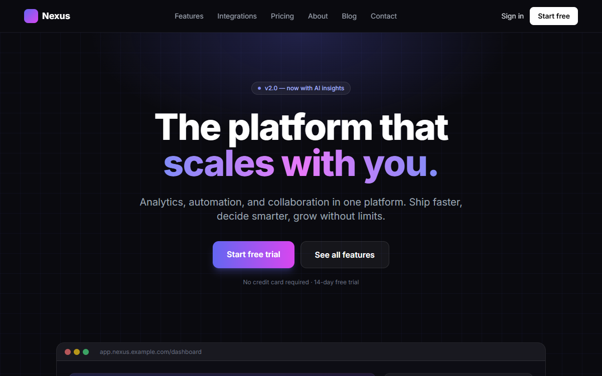
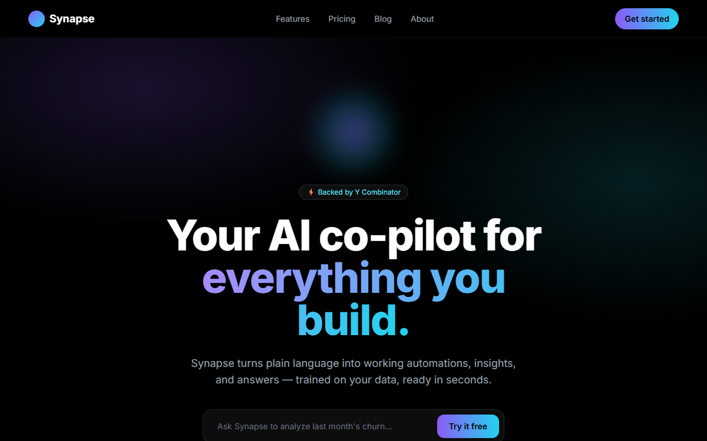
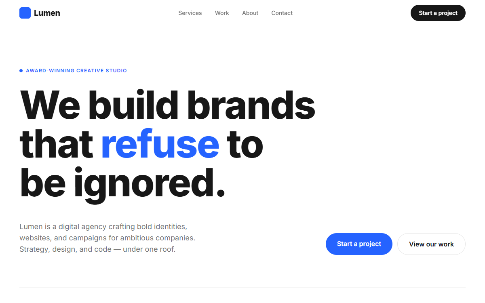
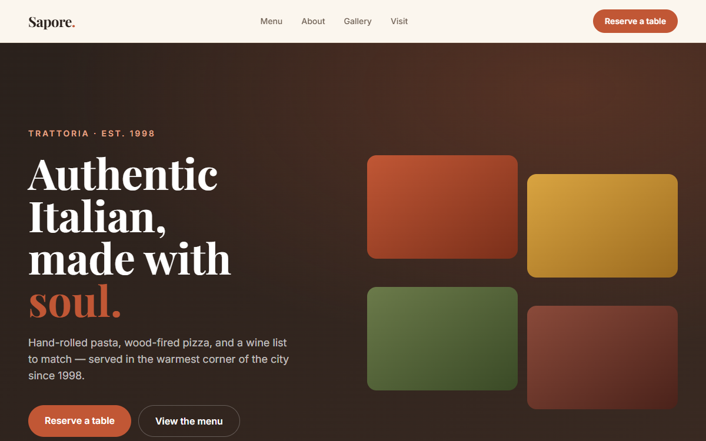
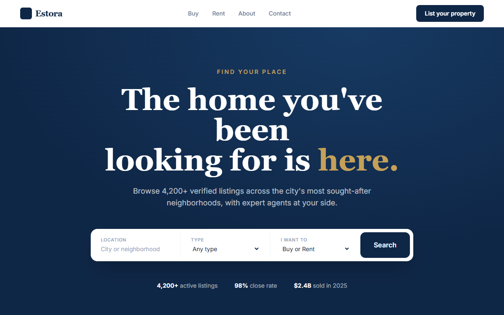
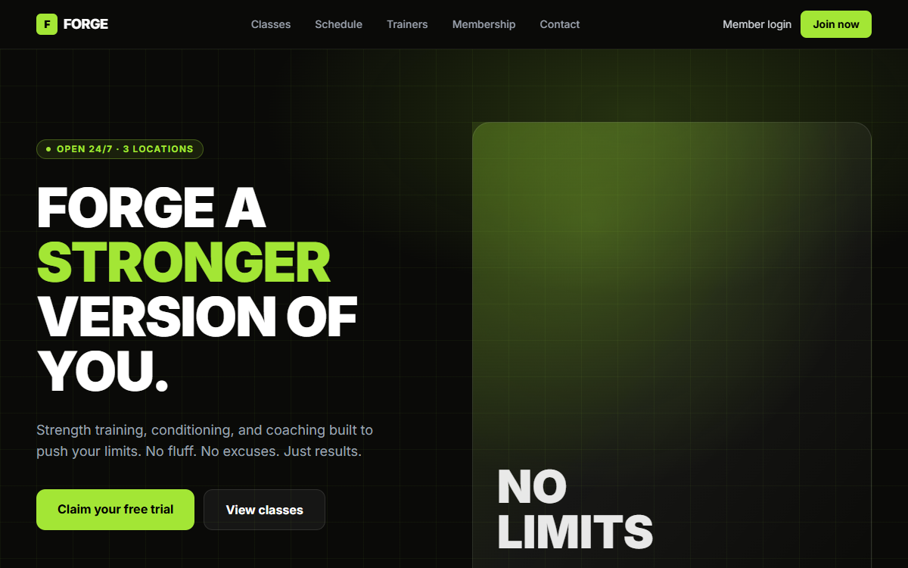
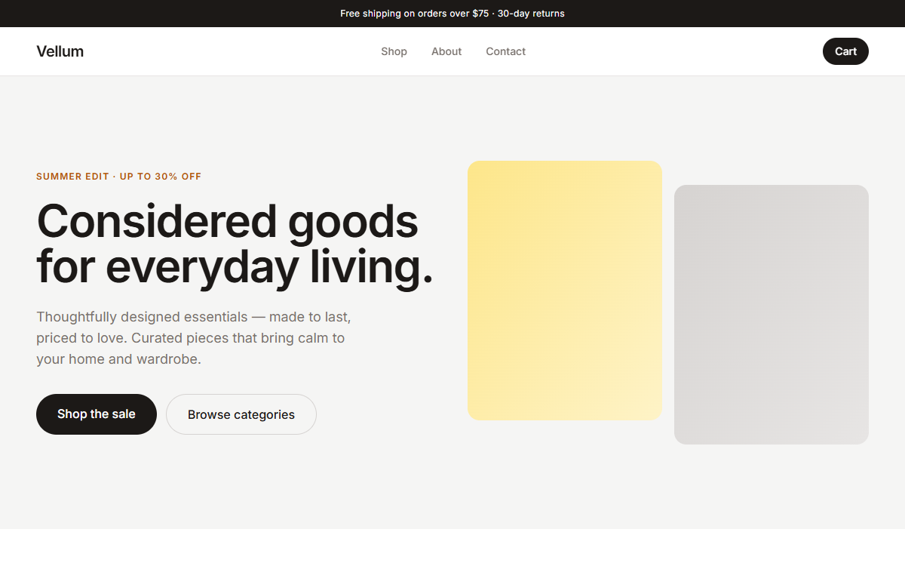
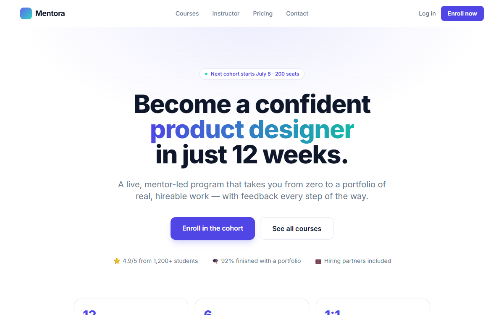

# Next.js + Tailwind Website Templates — 20 Production-Ready Themes

A collection of **20 modern, responsive website templates** built with **Next.js (App Router), Tailwind CSS, and TypeScript**. Every template is production-ready: clean code, SEO metadata, a working contact form API route, accessibility built in, and a one-command deploy to Vercel.

> 🎁 **Get all 20 templates in one bundle → [$79 (worth $380)](https://cengokurtoglu.gumroad.com/l/vuhstz)** — or buy any single template for **$19**.

Live previews and individual links are below. Built for indie hackers, freelancers, and small businesses who want a polished site without starting from a blank page.

---

## ✨ What every template includes

- **Next.js (App Router) + TypeScript** — modern, type-safe, maintainable
- **Tailwind CSS** — clean utility-first styling, easy to rebrand
- **Fully responsive** — mobile-first, looks right on every screen
- **SEO-ready** — metadata, Open Graph, JSON-LD structured data
- **Working contact form** — API route included, no extra setup
- **Accessible** — skip links, ARIA, semantic HTML
- **Deploy to Vercel in minutes** — README with customize + deploy steps

Just add your logo, colors, and content — then ship.

---

## 🖥️ Featured templates (live demos)

| Template | Preview | Live Demo | Get it |
|---|---|---|---|
| **Modern SaaS** Landing Page |  | [Demo](https://01-modern-saas.vercel.app) | [$19](https://cengokurtoglu.gumroad.com/l/butotw) |
| **AI Startup** Landing Page |  | [Demo](https://02-ai-startup.vercel.app) | [$19](https://cengokurtoglu.gumroad.com/l/mmpgds) |
| **Digital Agency** Website |  | [Demo](https://03-digital-agency.vercel.app) | [$19](https://cengokurtoglu.gumroad.com/l/beksi) |
| **Restaurant & Cafe** Website |  | [Demo](https://04-restaurant-cafe.vercel.app) | [$19](https://cengokurtoglu.gumroad.com/l/pdglka) |
| **Real Estate** Website |  | [Demo](https://05-real-estate.vercel.app) | [$19](https://cengokurtoglu.gumroad.com/l/rgpkzl) |
| **Fitness & Gym** Website |  | [Demo](https://06-fitness-gym.vercel.app) | [$19](https://cengokurtoglu.gumroad.com/l/twbjr) |
| **E-commerce Store** Website |  | [Demo](https://07-ecommerce-store.vercel.app) | [$19](https://cengokurtoglu.gumroad.com/l/jlpiuv) |
| **Online Course** Website |  | [Demo](https://08-online-course.vercel.app) | [$19](https://cengokurtoglu.gumroad.com/l/tnlnz) |

---

## 📦 All 20 templates in the bundle

The **[20 Website Templates Bundle ($79)](https://cengokurtoglu.gumroad.com/l/vuhstz)** includes the 8 above plus:

Dental Clinic · Restaurant Reservation · Barber & Salon · Photography Portfolio · Event & Conference · Web3 / Crypto · Mobile App Landing · Newsletter / Creator · Hotel Booking · Construction · Law Firm · Personal CV

That's **20 production-ready Next.js + Tailwind templates for $79** — vs. $380 if bought individually. **[Get the bundle →](https://cengokurtoglu.gumroad.com/l/vuhstz)**

---

## 🚀 Quick start (after purchase)

```bash
# unzip the template you want, then:
npm install
npm run dev      # http://localhost:3000
npm run build    # production build
```

Deploy to **Vercel**: push to a Git repo and import it, or run `vercel`. Update the contact form API route with your email provider, swap the logo/colors in the Tailwind config, and you're live.

---

## 🏷️ Keywords

Next.js template · Tailwind CSS template · React website template · Next.js landing page · SaaS website template · TypeScript website template · responsive website template · App Router template · Vercel template · startup website template

---

## 📄 License

These are **commercial templates**. Purchase grants you a license to use and customize them for your own and client projects. This repository is a showcase/catalog — template source code is delivered on purchase via [Gumroad](https://cengokurtoglu.gumroad.com).

Made by [@cekuu35](https://github.com/cekuu35) · Store: **[cengokurtoglu.gumroad.com](https://cengokurtoglu.gumroad.com)**
